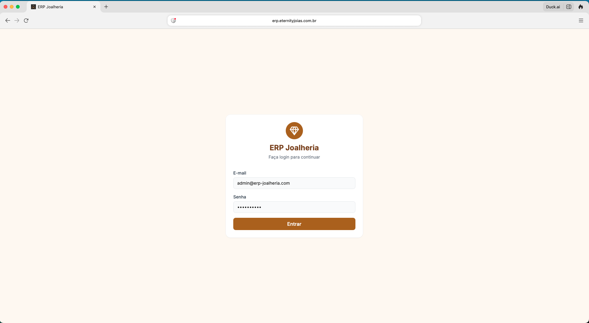
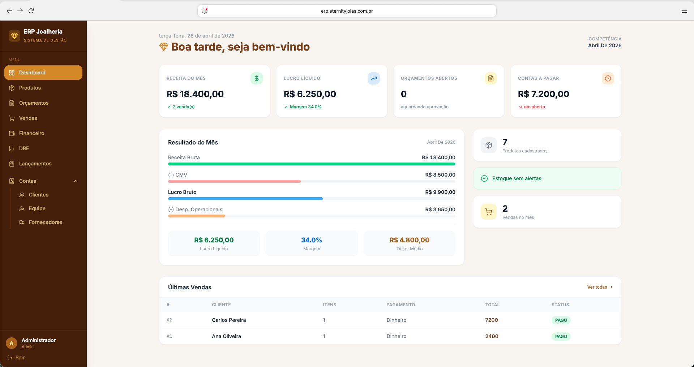
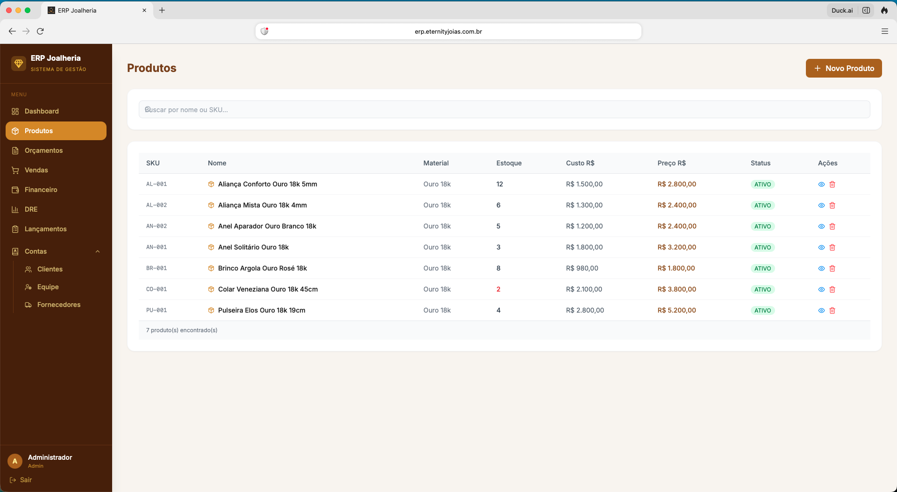

# ERP Joalheria

Sistema ERP + E-commerce completo para joalheria, desenvolvido como projeto real de portfólio. Inclui gestão de produtos, estoque, clientes, orçamentos, PDV, financeiro e vitrine online com integração WhatsApp.

> Projeto desenvolvido para um cliente real. Este repositório é uma versão whitelabel do código em produção.

## Screenshots





## Stack

| Camada | Tecnologia |
|---|---|
| Backend | NestJS · TypeScript · Prisma ORM · PostgreSQL 16 · Redis 7 |
| ERP Frontend | React 18 · Vite · TailwindCSS · Zustand · TanStack Query · React Router v6 |
| E-commerce | Next.js 14 (App Router) · TailwindCSS |
| Infra | Docker Compose · Turborepo · PM2 · Nginx |

## Módulos Implementados

| Módulo | Backend | Frontend |
|---|---|---|
| Auth (JWT + RBAC) | ✅ | ✅ Login |
| Produtos | ✅ CRUD completo | ✅ Lista + formulário |
| Estoque | ✅ Movimentações | ✅ |
| Categorias | ✅ | — |
| Clientes | ✅ | ✅ |
| Fornecedores | ✅ | ✅ |
| Orçamentos | ✅ | ✅ Lista + novo |
| Vendas (PDV) | ✅ | ✅ Lista + nova venda |
| Financeiro | ✅ Transações automáticas | ✅ |
| DRE | — | ✅ Relatório |
| Equipe / Usuários | ✅ | ✅ |
| Lançamentos (migração legado) | ✅ | ✅ |
| E-commerce | — | ✅ Catálogo + WhatsApp |

**Perfis de acesso:** Admin · Gerente · Vendedor · Estoquista

## Início Rápido

### Pré-requisitos

- Node.js 18+, Docker, Yarn

### 1. Instalar dependências

```bash
yarn install
```

### 2. Variáveis de ambiente

```bash
cp .env.example apps/erp-api/.env
# Edite apps/erp-api/.env com seus valores
```

### 3. Banco de dados

```bash
yarn db:up          # sobe PostgreSQL + Redis via Docker
yarn db:migrate     # aplica migrations Prisma
yarn db:seed        # seed com produtos de joias de exemplo
```

### 4. Rodar todos os apps

```bash
yarn dev
```

## URLs

| Serviço | URL |
|---|---|
| API REST | http://localhost:3000 |
| Swagger | http://localhost:3000/api/docs |
| ERP (React) | http://localhost:3001 |
| E-commerce | http://localhost:3002 |

**Login padrão:** `admin@erp-joalheria.com` / `Admin@2024`

## Arquitetura

```
apps/
  erp-api/        # NestJS REST API (porta 3000)
  erp-web/        # React ERP frontend (porta 3001)
  ecommerce-web/  # Next.js 14 vitrine pública (porta 3002)
packages/
  shared/         # @erp/shared — tipos TypeScript compartilhados
infra/
  docker-compose.yml  # PostgreSQL 16 + Redis 7
```

- **Auth:** JWT com Passport, guards de autenticação e autorização por papel.
- **Database:** Prisma ORM com `PrismaModule` global; cada domínio tem seu próprio módulo NestJS.
- **State management:** Zustand (auth) + TanStack Query (dados do servidor).
- **Rate limiting:** ThrottlerModule — 100 req / 60s globalmente.
- **API docs:** Swagger em `/api/docs`.

## Comandos úteis

```bash
yarn lint           # lint em todos os apps
yarn format         # prettier em todo o projeto
yarn db:studio      # Prisma Studio (GUI do banco)
yarn build          # build de produção de todos os apps
```

## Próximos Passos

- [ ] Integração WhatsApp via Evolution API (notificações de venda/compra/acerto)
- [ ] Backup automático do banco de dados
- [ ] E-commerce com catálogo público e checkout via WhatsApp
